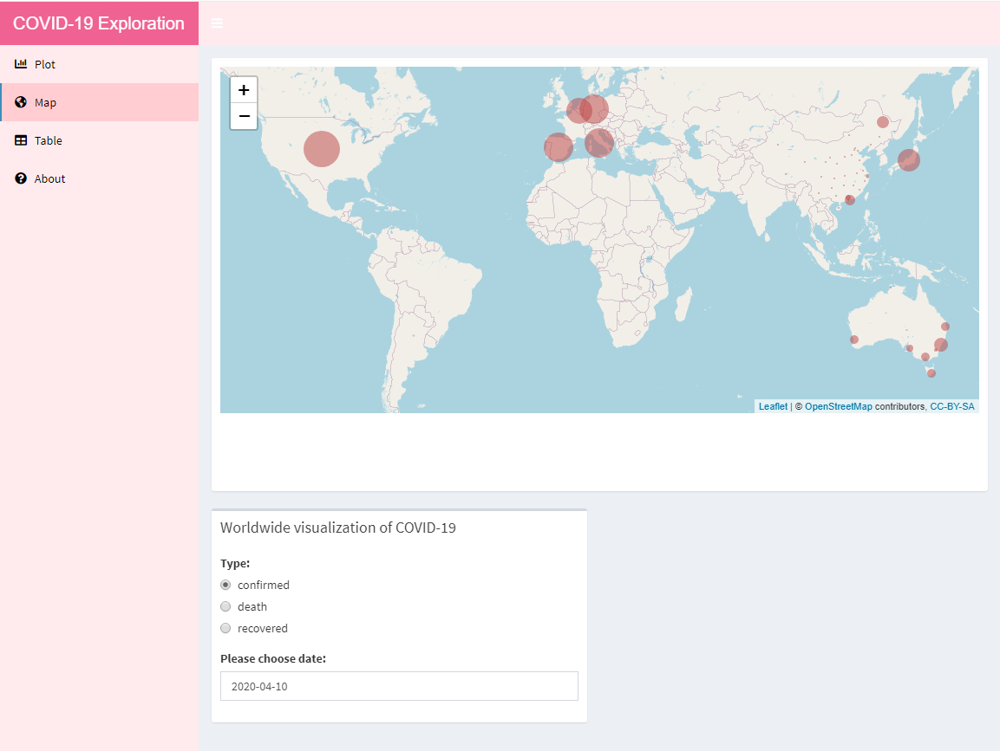
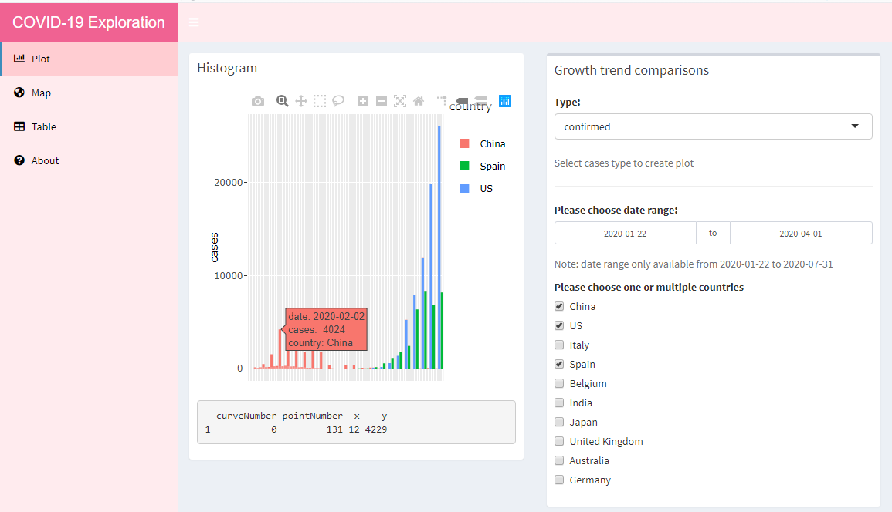
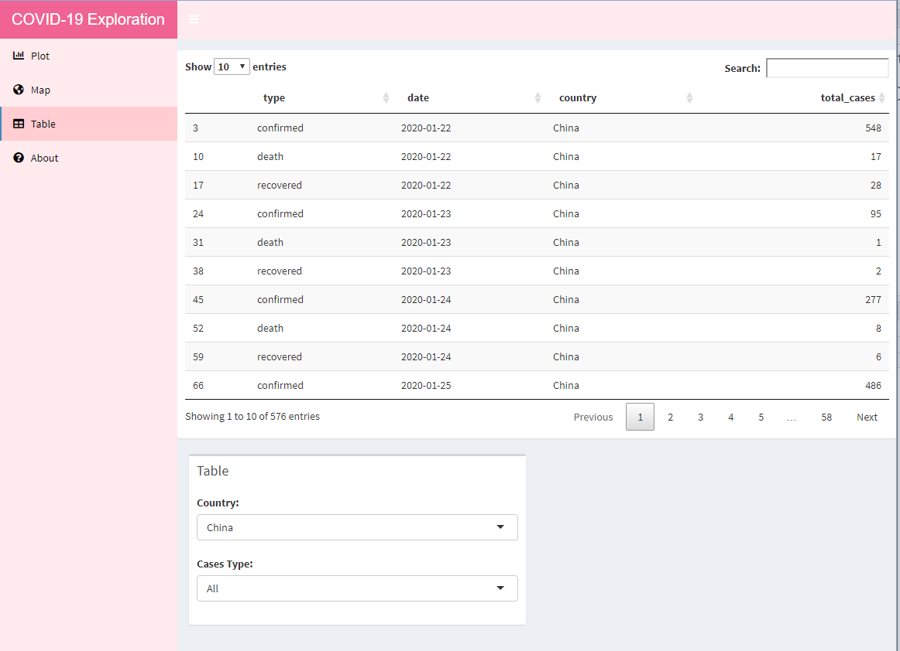

```{r, include = FALSE}
knitr::opts_chunk$set(
  collapse = TRUE,
  comment = "#>",
  fig.width = 5
)
```

```{r}
library(phyllispkg)
```


There are three data set use in this package and all are provided by the Johns Hopkins University Center for Systems Science and Engineering (JHU CSSE) and Rami Krispin and other 4 contributor provided a tidy format of the data as r package coronavirus. The package provides the `map` dataset, which contains longitude and latitude of  `r length(unique(map$country))`  main countries  `r glue::glue_collapse(unique(map$country),sep = ", ", last = " and ")` and different type of cases number every day. 

It can be accessed via:

```{r setup}
library(tibble)
library(phyllispkg)
map
```


{width=700px}

{width=700px}
{width=700px}
